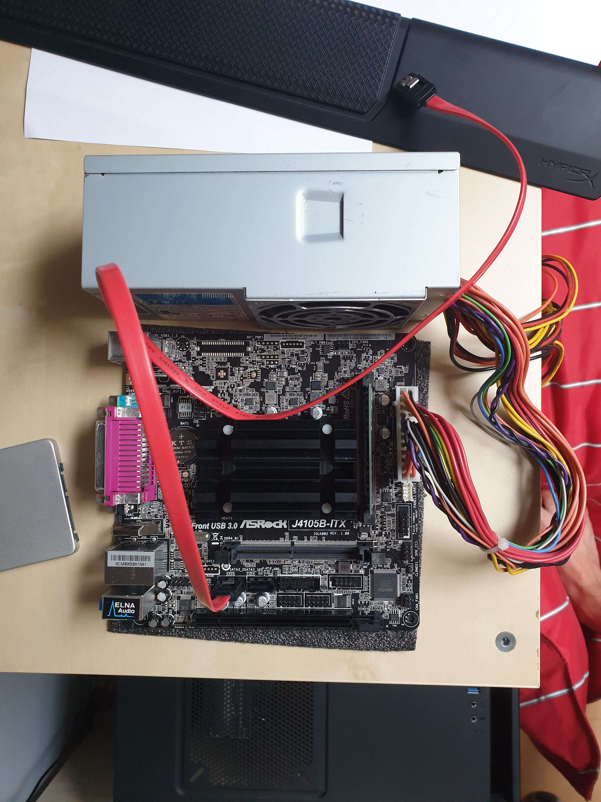

# Smart TV Box Project
## Autori: Bc. Oliver Hofer, Bc. Oleksandr Lypovetskyi

## 🧾 Popis
Cieľom projektu Smart TV Box je vytvoriť zariadenie, ktoré umožní používateľom starších televízorov bez Smart TV funkcionality využívať operačný systém Android TV po jednoduchom pripojení zariadenia k televízoru.

### Hardvérová koncepcia

Zariadenie bude postavené na notebookovej základovej doske, ktorá obsahuje:
- procesor,
- operačnú pamäť RAM,
- vstupno-výstupné rozhrania.
  
Do zariadenia budú tiež nainštalované:
- elektrický zdroj pre napájanie základovej dosky a periférií,
- 2.5" SSD disk ako dátové úložisko pre Android TV a používateľské dáta.

### Konštrukcia púzdra

Hardvérové komponenty budú umiestnené do dreveného púzdra, ktoré bude:
- vyrobené z preglejky,
- optimalizované pre prístup k portom a ventiláciu,
- esteticky doladené na domáce multimediálne použitie.

### 3D modelovanie a výroba

V rámci projektu budú pripravené 3D modely pre drevené púzdro, držiak pre 2.5" SSD disk.

Držiak SSD disku bude vytlačený na 3D tlačiarni a následne integrovaný do zariadenia.

### Očakávaný výsledok

Výsledkom projektu bude funkčný Smart TV Box, ktorý:
- poskytne plnú podporu Android TV na bežnom televízore,
- kombinuje PC komponenty s custom konštrukciou,
- umiestený do dreveného púzdra a má v sebe 3D tlačené prvky.

## 📰 Aktuálny stav

### Update ku dňu 19. novembra 2025

Bola kupená notebooková základová doska, ktorá okrem komponentov ako processor, RAM alebo integrovaná grafická karta disponuje vstupno-výstupnými rozhraniami ako:
- Video rozhrania HDMI, VGA,
- Ethernet rozhranie RJ45 pre pripojenie na Internet,
- univerzálne rozhranie USB,
- legacy vstupné rozhranie PS/2 pre staršie klavesnice alebo myši.

## 📁 Štruktúra
- `docs/` – dokumentácia
- `src/` – zdrojový kód (ak existuje)
- `tags.yaml` – metadáta
- `meta.json` – pre AI, API alebo Pages

## KNIFE Overview

- 🌐 Web: https://knife-framework.github.io/knifes_overview/
- 📚 Dokumentácia: `/docs/sk`
- ⚙️ Build/Deploy: pozri **[Makefile-README.md](./Makefile-README.md)**

## License

This repository uses a **dual license**:

- **Code and scripts**: [MIT License](./LICENSE)  
- **Educational content and documentation (`.md` files, methodologies, notes)**: [CC-BY 4.0 License](./LICENSE-DOCS)  

This means you are free to use and adapt the code with minimal restrictions, and you may freely
share and remix the educational content as long as you provide proper attribution.
